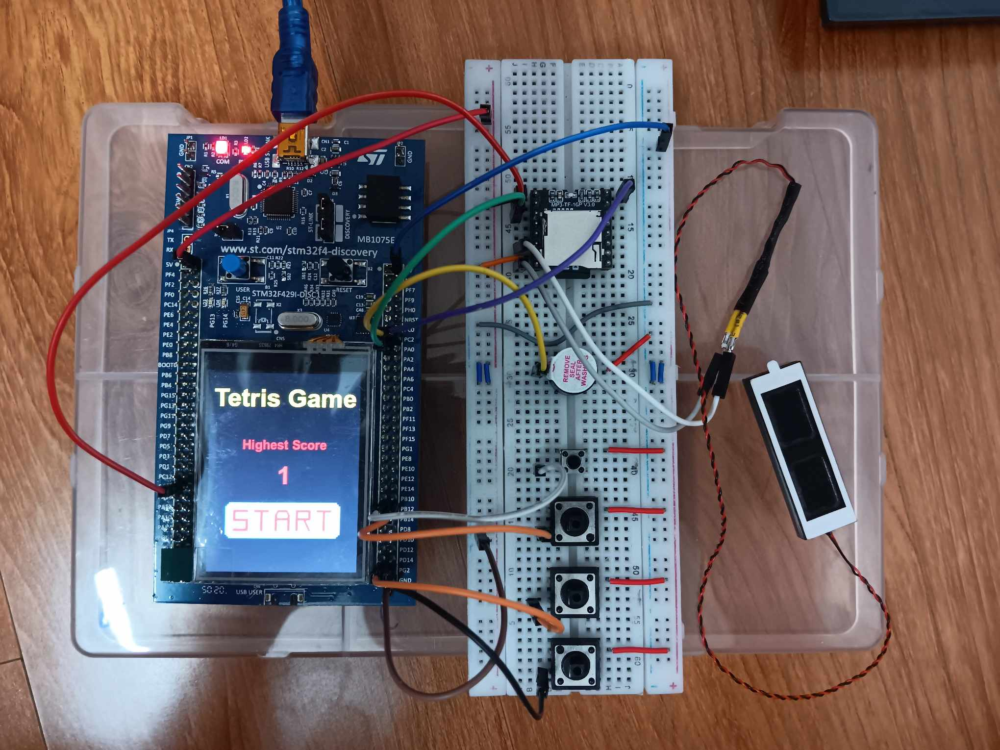
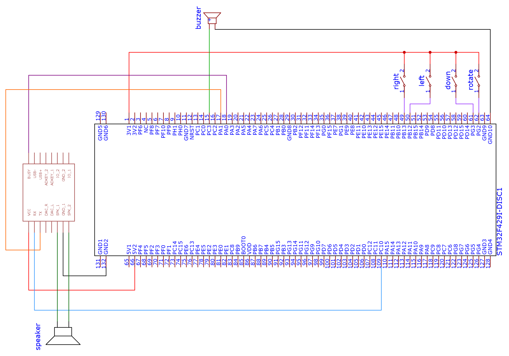

## GIỚI THIỆU

__Đề bài__: Game Tetris

__Sản phẩm:__
1. Hiển thị giao diện đồ họa với màn hình TFT 240x320 thông qua bộ điều khiển LTDC của board
2. Điều khiển trò chơi bằng phím cứng: cho phép di chuyển các khối sang trái/phải, xoay, rơi
3. Quản lý lưới, phát hiện va chạm, kiểm tra và xóa hàng đầy
4. Chia cấp độ trò chơi với 3 mức easy, medium, hard
5. Hiển thị điểm số, ghi điểm số cao nhất vào flash

## TÁC GIẢ

- Tên nhóm: __Áo hồng__
- Thành viên trong nhóm
  |STT|Họ tên|MSSV|Công việc|
  |--:|--|--|--|
  |1|Kiều Văn Bảo|20225261|Phát triển logic game, xử lý ngắt, flash|
  |2|Trần Duy Anh|20225256|phát triển logic tạo khối, di chuyển khối, đổ màu khối|
  |3|Vũ Tiến An Nguyên|20225148|Viết báo cáo, kiểm thử, phát triển logic game|

## MÔI TRƯỜNG HOẠT ĐỘNG

- STM32F429ZIT6
- Bộ kit STM32F429ZIT6 tích hợp cảm biến, màn hình cảm ứng
- Module dfplayer mini cho việc phát âm thanh

## SO ĐỒ SCHEMATIC

### TÍCH HỢP HỆ THỐNG

* Phần cứng
|Thành phần|Vai trò|
  |--|--|
  |STM32F429ZIT6|Bo mạch điều khiển chính, xử lý toàn bộ logic game và giao tiếp phần cứng|
  |Màn hình LCD|Hiển thị giao diện trò chơi Tetris và nhận thao tác Start qua cảm ứng|
  |4 nút nhấn|Điều khiển trò chơi (di chuyển khối Tetris, xoay, thả nhanh)|
  |Dfplayer mini|Giải mã thẻ nhớ, gửi tín hiệu âm thanh cho speaker|
  |Breadboard + dây nối	|Tạo mạch kết nối phần cứng giữa các thiết bị|

* Phần mềm
|Thành phần|Vai trò|
  |--|--|
  |Firmware chính(C/C++)|Điều khiển game logic, xử lí giao tiếp với nút|
  |TouchGFX|Thiết kế giao diện game|
  |STM32CubeIDE|Môi trường phát triển, biên dịch và nạp chương trình|
  |EasyEDA|Thiết kế Schematic|
